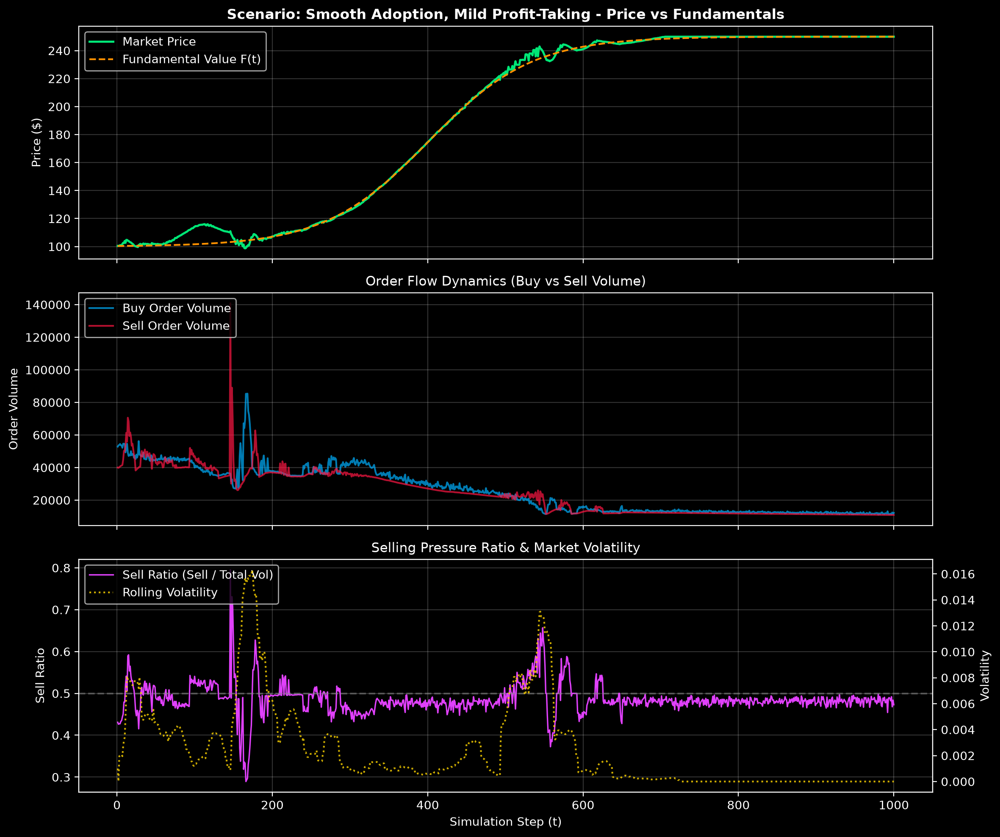
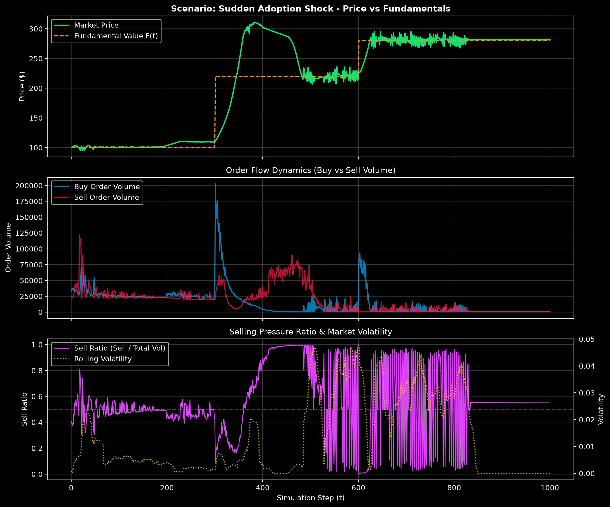
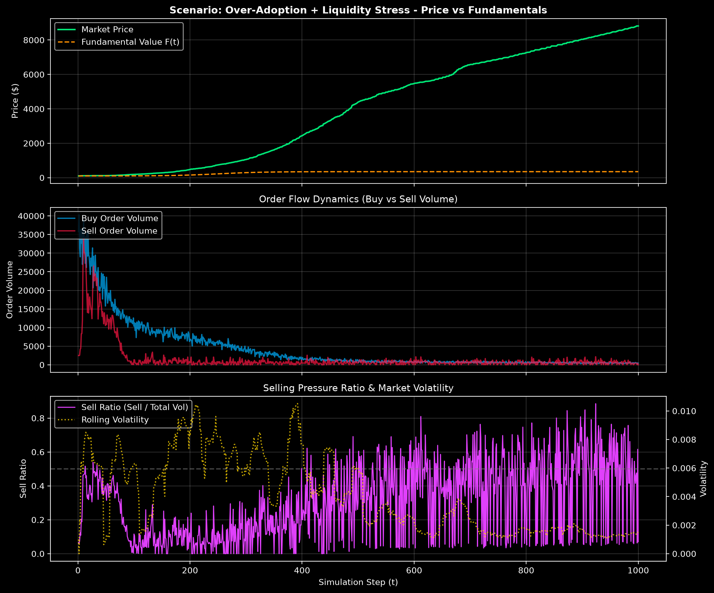
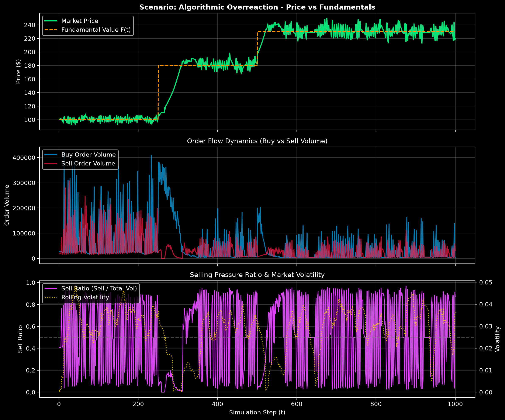

# Market Microstructure Simulation Report: Selling Pressure & Adoption Dynamics

## AILEE Finance Runtime Exposure Analysis

This report delivers a rigorous agent-based market microstructure analysis evaluating **SELLING PRESSURE**
under massive adoption of the **AILEE Finance Runtime** for a bullish software asset (*AILEE Core Token* / *Runtime Credit*).

### Executive Summary

When a transformative software asset experiences exponential or step-function fundamental adoption, conventional wisdom assumes monotonic price appreciation.
However, discrete market order book dynamics reveal that **selling pressure naturally emerges within bullish regimes** due to heterogeneous agent behavioral feedback loops.

- **Profit-Taking Saturation:** As fundamental value $F(t)$ and adoption $A(t)$ rise, early holders lock in profits, creating counter-cyclical sell walls.
- **Panic Cascades & Drawdowns:** Sudden adoption spikes induce short-term price overshoots followed by sharp mean-reversions, triggering stop-loss cascades among panic sellers.
- **Liquidity Provider Constraints:** Constrained order book depth accelerates price slippage during heavy order flow imbalances, magnifying temporary drawdowns despite strong fundamentals.
- **Algorithmic Arbitrage Feedback:** High-frequency momentum and arbitrage agents can amplify transient mispricings, producing elevated selling pressure duration before eventual recovery.

---

## Comprehensive Scenario Comparison

| Scenario Name | Key Microstructure Focus | Max Drawdown (%) | Peak Price ($) | Final Price ($) | Mean Sell Ratio | Max Sell Pressure Duration (Steps) | Recovery Time (Steps) |
| :--- | :--- | :---: | :---: | :---: | :---: | :---: | :---: |
| **Smooth Adoption, Mild Profit-Taking** | Gradual logistic increase in adoption A(t) with low volatility | 14.92% | $249.92 | $249.92 | 0.486 | 8 | 1 steps |
| **Sudden Adoption Shock** | Discrete jump in fundamental value F(t) and adoption A(t) | 33.46% | $311.07 | $281.55 | 0.552 | 167 | N/A |
| **Over-Adoption + Liquidity Stress** | Very strong adoption demand coupled with severely constrained liquidity providers to evaluate market fragility and severe drawdowns. | 1.44% | $8,817.24 | $8,817.24 | 0.302 | 6 | 1 steps |
| **Algorithmic Overreaction** | Aggressive algorithmic arbitrageurs and momentum rules amplifying short-term mispricing | 15.13% | $249.51 | $219.88 | 0.507 | 27 | 71 steps |

---

## Detailed Scenario Analyses

### Scenario: Smooth Adoption, Mild Profit-Taking

**Configuration & Overview:** Gradual logistic increase in adoption A(t) with low volatility, measuring baseline selling pressure from profit-taking.

#### Selling Pressure Indicators & Key Metrics
- **Max Drawdown:** `14.92%`
- **Peak Price Achieved:** `$249.92`
- **Final Market Price:** `$249.92`
- **Total Traded Volume:** `16,269,416.94` units
- **Average Sell Volume Ratio:** `0.486`
- **Max Consecutive Elevated Selling Steps:** `8` steps
- **Recovery Time to Peak Post-Cascade:** `1` steps

#### Agent Breakdown & Performance

| Agent Persona | Count | Start Inventory | Final Inventory | Total Realized P&L ($) | Total Portfolio Val ($) | Mean Turnover |
| :--- | :---: | :---: | :---: | :---: | :---: | :---: |
| Arbitrageur | 40 | 480,000 | 320,547 | $37,203,499.78 | $178,299,824.03 | 1.40x |
| Bullish Adopter | 80 | 800,000 | 1,557,431 | $0.00 | $389,308,099.06 | 3.37x |
| Liquidity Provider | 40 | 800,000 | 795,210 | $89,447,734.93 | $259,772,390.59 | 0.25x |
| Panic Seller | 40 | 200,000 | 86,781 | $1,596,488.14 | $37,717,760.52 | 2.74x |
| Profit Taker | 60 | 480,000 | 31 | $8,676,526.27 | $86,681,125.75 | 5.89x |

---

### Scenario: Sudden Adoption Shock

**Configuration & Overview:** Discrete jump in fundamental value F(t) and adoption A(t), measuring price spike, profit-taking wave, and panic selling response.

#### Selling Pressure Indicators & Key Metrics
- **Max Drawdown:** `33.46%`
- **Peak Price Achieved:** `$311.07`
- **Final Market Price:** `$281.55`
- **Total Traded Volume:** `7,167,126.45` units
- **Average Sell Volume Ratio:** `0.552`
- **Max Consecutive Elevated Selling Steps:** `167` steps
- **Recovery Time to Peak Post-Cascade:** `-1` steps

#### Agent Breakdown & Performance

| Agent Persona | Count | Start Inventory | Final Inventory | Total Realized P&L ($) | Total Portfolio Val ($) | Mean Turnover |
| :--- | :---: | :---: | :---: | :---: | :---: | :---: |
| Arbitrageur | 40 | 480,000 | 591,807 | $86,381,165.96 | $251,894,288.88 | 1.91x |
| Bullish Adopter | 80 | 800,000 | 1,585,024 | $4,105,321.03 | $446,337,186.04 | 3.76x |
| Liquidity Provider | 30 | 450,000 | 363,137 | $18,084,056.74 | $104,896,963.28 | 1.48x |
| Panic Seller | 50 | 250,000 | 1 | $66,343.04 | $40,066,389.07 | 6.36x |
| Profit Taker | 70 | 560,000 | 32 | $15,936,192.08 | $106,942,172.65 | 6.56x |

---

### Scenario: Over-Adoption + Liquidity Stress

**Configuration & Overview:** Very strong adoption demand coupled with severely constrained liquidity providers to evaluate market fragility and severe drawdowns.

#### Selling Pressure Indicators & Key Metrics
- **Max Drawdown:** `1.44%`
- **Peak Price Achieved:** `$8,817.24`
- **Final Market Price:** `$8,817.24`
- **Total Traded Volume:** `1,609,002.63` units
- **Average Sell Volume Ratio:** `0.302`
- **Max Consecutive Elevated Selling Steps:** `6` steps
- **Recovery Time to Peak Post-Cascade:** `1` steps

#### Agent Breakdown & Performance

| Agent Persona | Count | Start Inventory | Final Inventory | Total Realized P&L ($) | Total Portfolio Val ($) | Mean Turnover |
| :--- | :---: | :---: | :---: | :---: | :---: | :---: |
| Arbitrageur | 20 | 120,000 | -2,085 | $7,978,406.09 | $17,823,593.36 | 68.54x |
| Bullish Adopter | 110 | 1,320,000 | 2,276,266 | $1,612,200,322.95 | $20,127,080,065.74 | 51.95x |
| Liquidity Provider | 10 | 50,000 | 1,007 | $-5,303,618.75 | $9,003,654.51 | 87.37x |
| Panic Seller | 60 | 420,000 | 434,775 | $0.00 | $3,855,865,499.45 | 5.50x |
| Profit Taker | 80 | 800,000 | 37 | $14,622,695.35 | $142,947,586.93 | 148.92x |

---

### Scenario: Algorithmic Overreaction

**Configuration & Overview:** Aggressive algorithmic arbitrageurs and momentum rules amplifying short-term mispricing, inducing selling cascades and volatile recovery.

#### Selling Pressure Indicators & Key Metrics
- **Max Drawdown:** `15.13%`
- **Peak Price Achieved:** `$249.51`
- **Final Market Price:** `$219.88`
- **Total Traded Volume:** `26,198,427.86` units
- **Average Sell Volume Ratio:** `0.507`
- **Max Consecutive Elevated Selling Steps:** `27` steps
- **Recovery Time to Peak Post-Cascade:** `71` steps

#### Agent Breakdown & Performance

| Agent Persona | Count | Start Inventory | Final Inventory | Total Realized P&L ($) | Total Portfolio Val ($) | Mean Turnover |
| :--- | :---: | :---: | :---: | :---: | :---: | :---: |
| Arbitrageur | 90 | 1,800,000 | 2,041,317 | $94,228,982.31 | $653,802,954.00 | 2.19x |
| Bullish Adopter | 60 | 480,000 | 951,278 | $0.00 | $209,222,612.49 | 3.16x |
| Liquidity Provider | 30 | 360,000 | 377,355 | $33,893,295.89 | $102,290,863.34 | 0.57x |
| Panic Seller | 50 | 250,000 | 20 | $-1,804,903.43 | $38,194,763.07 | 5.21x |
| Profit Taker | 60 | 480,000 | 29 | $13,480,565.33 | $91,484,407.02 | 5.57x |

---

## Architectural Insights & Strategic Takeaways

1. **Selling Pressure is an Inherent Feature of Bullish Adoption:** Even under continuous adoption $A(t)$ growth, selling pressure peaks during rapid price expansions as profit-takers rebalance portfolio weights.
2. **Order Book Depth Dampens Cascade Duration:** Liquidity provider depth and spread resilience are critical in preventing profit-taking from degenerating into panic-seller cascades.
3. **Algorithmic Arbitrage as a Stabilizing Buffer:** When arbitrageurs operate with balanced risk limits, they efficiently absorb sell walls and minimize recovery times back toward $F(t)$.
4. **AILEE Finance Runtime Integration:** These microstructure findings confirm that AILEE's Layer 11 (Portfolio Constraints), Layer 13 (Stress Override), and Layer 17 (Chart Intelligence / Fibonacci Advisory) effectively safeguard automated trading modules against transient selling cascades.

---
*Report generated automatically by `scripts/generate_upsidemd.py`.*